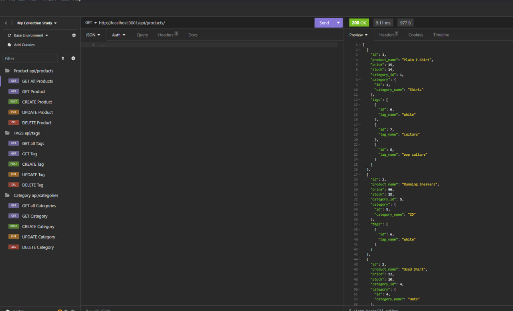
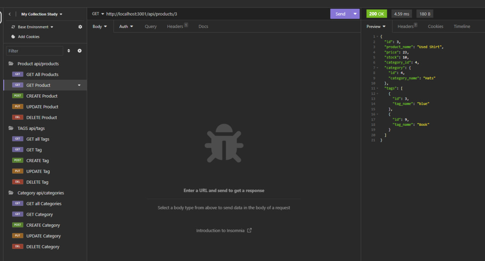
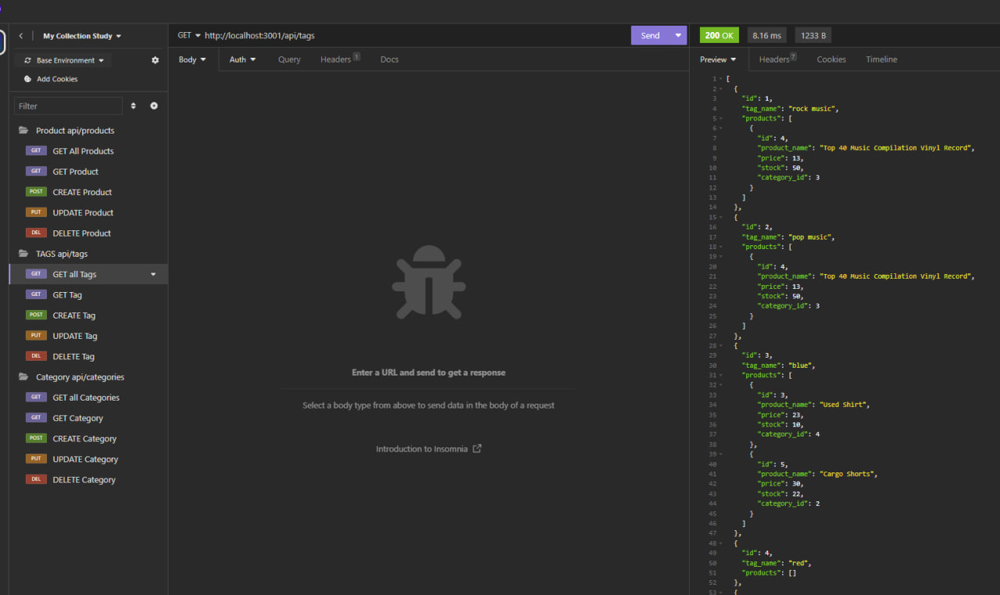
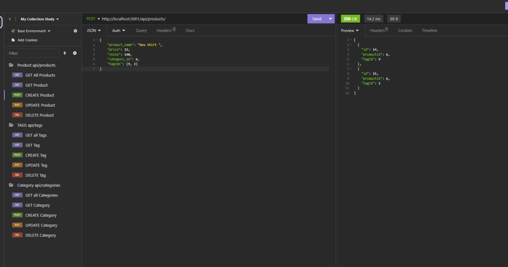
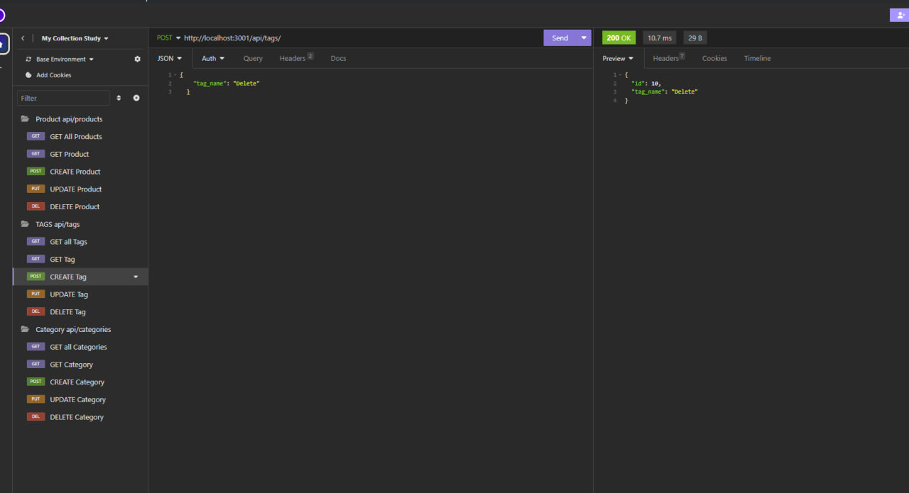
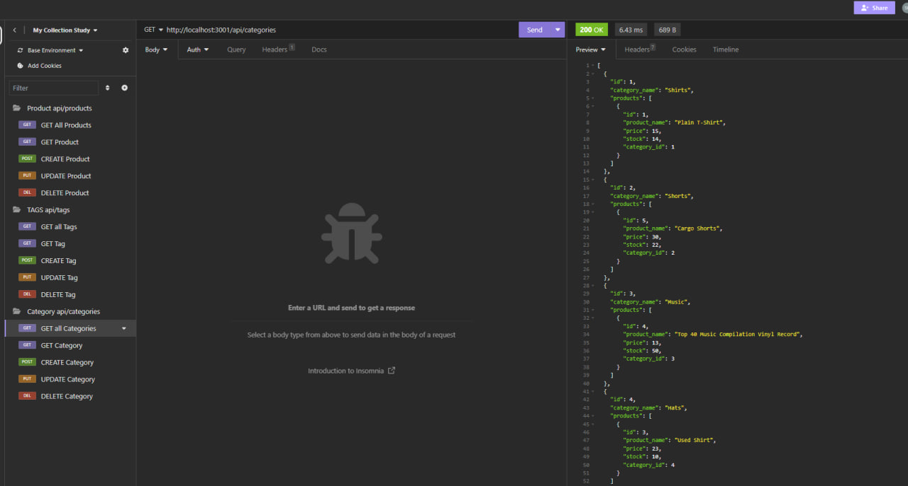

# E-commerce-Back-End
Back end application
## Description

In this project I wanted to modifye back end application that can store data of the differen products. I wanted to add different functionality like :
- 
- 
- 
- 
- 
-
- 

## Table of Contets

- [Screenshots](#screenshots)
- [Links](#links)

## Screenshots

In this section I provided screenshots of the  Application's functionality.

## Links

In this section I added links to the video of application and to the GitHub repositories with the original codebase and modifyed one.

The URL of the video:
    https://www.youtube.com/watch?v=Ln_LBMWPNEE

Original Code Repository:
    https://github.com/coding-boot-camp/fantastic-umbrella

GitHub link with modifyed code:
    https://github.com/MykhailoZakh/E-commerce-Back-End